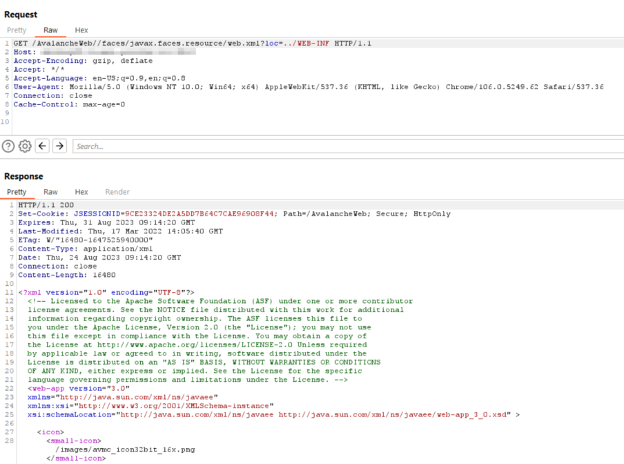
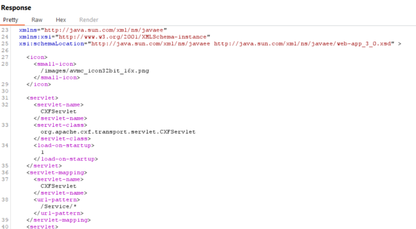
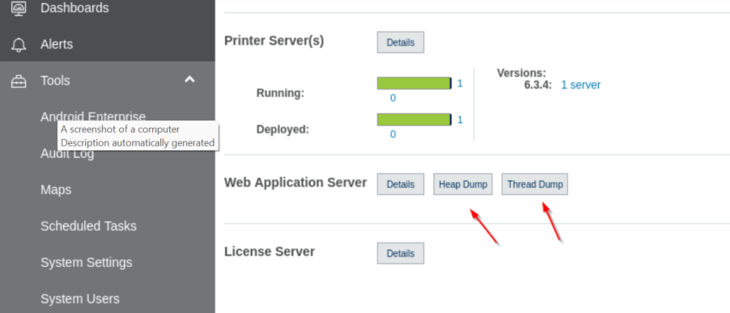

# IVANTI AVALANCHE - PATH TRAVERSAL

A new vulnerability has been found on Ivanti Avalanche. Tested on Avalanche Server `v6.3.4.153` and identified as CVE-2023-41474.

It’s a limited unauthenticated path traversal vulnerability, meaning that unauthorized attackers can access to any file under 
`C:\\PROGRAM DATA\\Wavelink\\AVALANCHE\\Web\ webapps\AvalancheWeb` in a default configuration. However, only some file extensions 
are affected to be displayed like `.xml` or `.html` (there are some more and they also depend on .htaccess rules).

To exploit this issue, an attacker can use the following URL:

`<domain>/AvalancheWeb//faces/javax.faces.resource/<file>?loc=<directory>`

As an example, the attacker can access to `web.xml` file under the parent directory `WEB-INF`. The request can be modified to access any file in any subdir.
To reproduce the attack any program like wget or curl can be used with basic arguments.
The following BurpSuite screenshot can be used as an example of successful exploitation.

# Increasing the impact

In a real scenario, an unauthenticated attacker can access to configuration settings and other internal information with low confidentiality impact.
However, in some scenarios there are files in this directory that can be used for session hijacking and have a complete server compromission.
If the attacker possesses administrative privileges (or there is an administrator that performed this step previously), it can perform a Heap dump 
of the Avalanche process (this functionality exists originally for debugging purposes). The functionality can be found at 
`Tools > Support and Licensing > Web Application Server > “Heap Dump” and/or “Thread Dump”`

A successful response of the server includes the path where the process dump is stored.

Since the file is stored at `C:\Program Files\Wavelink\Avalanche\Web\webapps\ AvalancheWeb\dump.hprof` it’s hence more accessible via the path traversal 
attack. Now, it’s time the attacker to download the dump file and perform an analysis of it. 

`wget --no-check-certificate '<domain>/AvalancheWeb//faces/javax.faces .resource/dump.hprof?loc=../'`

Via performing some basic string searches, it’s possible to find the login request’s bodies still in memory. 

Within the bodies, username and passwords are exposed to attackers. They can use this information to elevate privileges or move laterally 
within the environment.
